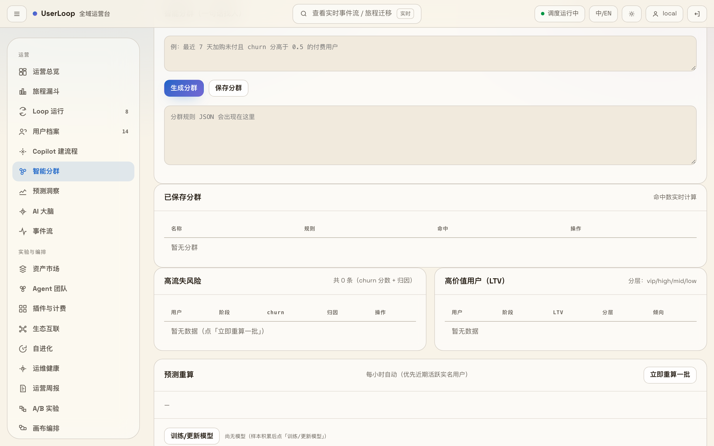
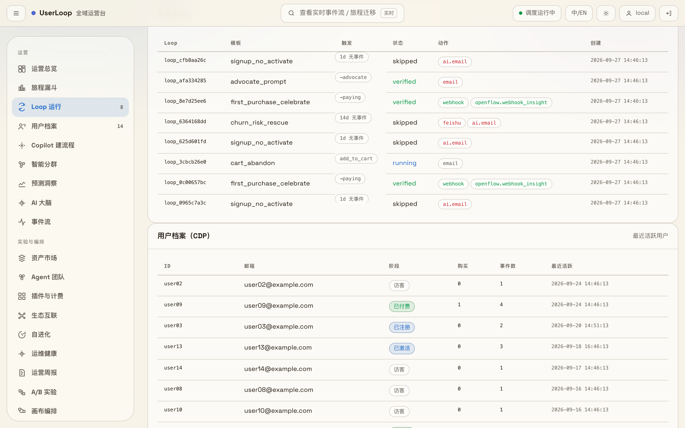
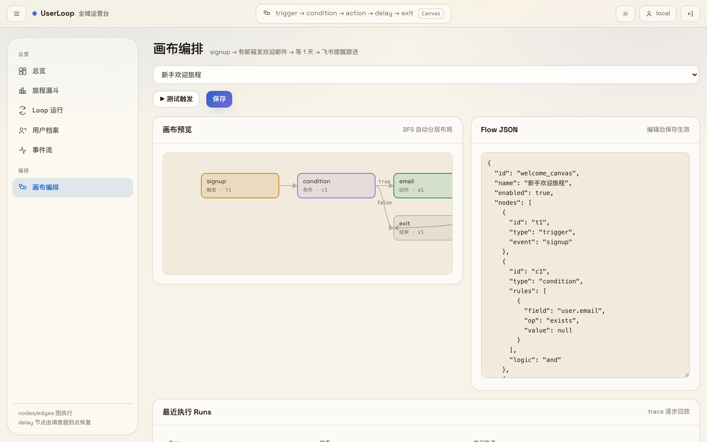
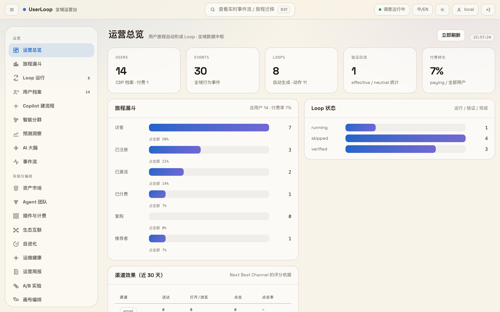

# 附录 · 功能总表(每个模块的介绍 · 使用说明 · 截图)

> 按「数据接入 → 洞察与分群 → 旅程与触达 → Agent 与进化 → 运营与计费」五章组织,与 `userloop` 包的子模块一一对应。
> 每项含:功能介绍(1-2 句,讲用户价值不讲实现)/ 怎么用 / 截图。
> 标注 📷 的有真实截图;文末说明截图补全进度。

UserLoop 的信息架构就是这条数据流:事件从各渠道进来(Hub 归一、CDP 建档),长出洞察与分群(预测、AI 决策),变成旅程与触达(Loop、Canvas、多通道动作),由 Agent 在护栏内执行并自我进化,最后由计费、运维、资产市场兜住规模化运营。每章开头一句话,讲这一段在闭环里的位置。

---

## 一 · 数据接入:闭环的原料

没有全域数据,一切洞察都是猜。这一章的三件事负责把散在各处的用户行为收进自己的库——不租外部 CDP,档案在自己手里。

#### 旅程埋点(自收数) `userloop/tracking/`

零依赖 JS 追踪脚本:任意站点一行 `` 贴进站点,事件即流入 `/api/v1/track`;打开控制台「事件流」即可看到实时数据。

#### 全域数据中枢(Hub) `userloop/hub/`

多源入站归一化:GA4 / Segment / Shopify / HubSpot / 通用格式自动识别,统一转成标准 ingest 事件交给事件总线;可选 HMAC 源级鉴权,原始报文落盘可对账回放。

**怎么用**:把外部系统的 webhook 指向 `POST /api/v1/hub/ingest?source=segment`(缺省自动识别);配 `hub.sources.<source>.secret` 后带 `X-Hub-Signature` 校验。

#### 生态集成适配器 `userloop/integrations/`

OpenFlow / MFlow / inFlow / HubSpot / WebsFlow 的出入站适配:OpenFlow 站内事件流入、高价值信号 HMAC 回推其 CDP、MFlow 断点变选题(只建草稿)、HubSpot lifecycle 同步;全部走公开 API,拔掉任何一路闭环不中断。

**怎么用**:在 `config.json` 的 `integrations.*` 配对方地址与 token;`/api/v1/capabilities` 可随时探测哪些集成在线(未配置记 skipped,不算故障)。

---

## 二 · 洞察与分群:把数据变成判断

BI 本该做好的事:看懂每个用户、圈出每群人。这一章把洞察从报表里拉出来,变成可直接执行的人群与分数。

#### 智能分群(自然语言圈人) `userloop/segments/`

一句话生成可执行人群规则:AI 只产规则 JSON,服务端强校验字段 / 操作符 / 取值(白名单:stage / stats.* / props.* / score.* / silence_days 等),越权即裁剪;命中数实时计算,分群可保存复用。

**怎么用**:控制台 →「智能分群」→ 输入如「最近 7 天加购未付且 churn 分高于 0.5 的付费用户」→ 生成 / 保存分群。

📷 

#### 预测层(churn / LTV / 购买倾向) `userloop/predict/`

可解释规则模型 v1:churn 风险、LTV 分层(vip/high/mid/low)、购买倾向,每个分数带归因——运营能回答「为什么这个用户被认为是高风险」;特征与标签持续沉淀,为将来拟合模型备好训练数据。

**怎么用**:每小时自动重算(优先近期活跃实名用户);控制台「智能分群」页直接看高流失风险与高价值用户两栏,或点「立即重算一批」。

#### AI 大脑(Next Best Action + 护栏) `userloop/ai/`

全域全生命周期运营 AI:按阶段、统计、最近行为、历史 Loop 效果与频控状态,为每个用户决定下一步最佳动作;低风险自动执行、中风险进审批门、高风险阻断,noop 允许「不打扰」。附带 Copilot(自然语言建 Loop / Canvas 草稿,人审后才启用)、发前护栏与运营周报生成。

**怎么用**:`config.json` 设 `ai.brain.enabled=true` 后自动运转(或 `userloop brain --force` 手动触发);控制台「AI 大脑」页逐条 / 批量审批待批决策;「Copilot 建流程」页一句话生成旅程草稿。

---

## 三 · 旅程与触达:判断变成动作

MA 本该做好的事:在对的时机用对的通道触达对的人,并且知道有没有用。这一章是 UserLoop 的执行层。

#### 核心引擎(旅程 / Loop / Canvas / 验证) `userloop/core/`

闭环的心脏,四件套:旅程引擎做 8 阶段生命周期判定与三类断点检测;Loop 引擎把断点 × 模板变成 LoopRun 状态机(pending → running → verifying → verified/failed,含冷却控制);Canvas 引擎执行 trigger / condition / action / delay / exit 五类节点的图流程;验证回流在窗口到期比对目标事件,verdict 落库更新档案。

**怎么用**:`userloop demo` 一键看完整闭环;内置 5 模板在 `data/loop-templates.json`(可自建扩展);Canvas 在控制台「画布编排」页编辑与测试触发。

📷 

#### 画布编排(Canvas) `userloop/web/canvas.html`

把旅程画出来:控制台画布页可视化查看 / 编辑流程,BFS 自动分层布局,Flow JSON 修改后保存生效,支持用指定用户与事件做测试触发,执行 trace 逐步回放。

**怎么用**:控制台 →「画布编排」→ 选流程(内置「新手欢迎旅程」)→ 编辑节点或 JSON → 保存 / 测试触发。

📷 

#### 触点调度与个性化 `userloop/touch/`

触达的统一调度层:Next Best Channel 按意图选渠道、跨渠道全局频控门(模板 Loop 与 AI 决策共用)、A/B 版式分桶、发前质检门(block 拦下 / warn 放行)、千人千面内容(来源 / 设备 / UTM / 旅程阶段)、H5 触点页与留资识别、对话式触达(任何能 POST 入站消息的渠道都能接入,有记忆可多轮)。

**怎么用**:`config.json` 配 `touch.email.*`(SMTP)或飞书 / Webhook;频控与质检默认生效,阈值可在 `touch.frequency` 调;对话触达接 `POST /api/v1/hub/message`。

#### A/B 版式实验 `userloop/experiments/`

版式定赢家:hash 稳定分桶(同一用户始终同一版式),变体只覆盖内容槽位(标题 / 正文 / CTA / 语气),指标按变体聚合(送达 / 打开 / 点击 / 转化),双比例 z 检验判定显著性,一键 promote 获胜版式。

**怎么用**:控制台 →「A/B 实验」页查看各实验的指标与 verdict;到期自动判定,也可手动触发 evaluate / promote。

#### 动作执行器 `userloop/actions/`

所有出站动作的宿主:webhook / 邮件(SMTP 真发)/ 飞书 / HubSpot / DeepSeek AI 文案;未配置外部通道时自动降级 dry-run(写 outbox 而不外发),保证闭环始终可跑通,执行结果全部落 outbox 审计。

**怎么用**:配好 SMTP / Webhook 即真发;未配置时跑 `userloop demo`,在 outbox 里看「本应发出什么」。

---

## 四 · Agent 与进化:让系统自己长大

AI Agent 不是噱头,是让数据基建变现的执行者:角色化 Agent 在白名单内动手,系统用自身运行数据改进自身。

#### 智能体运营团队 `userloop/agents/`

角色化 Agent(analyst / content / outreach / support)+ 跨角色编排:运营目标先走确定性配方拆解(可演示、可验收),LLM 只作可选增强;人只审批,Agent 在白名单工具内执行,产出回到状态机与审批门。

**怎么用**:`/api/v1/capabilities` 查看可用角色与配方;控制台「Agent 团队」页发起目标、看执行与审批。

#### 自进化 `userloop/evolve/`

迭代飞轮四件套:版本化交付(VERSION + CHANGELOG)、运行遥测快照落盘、Lessons 错误只犯一次(沉淀到 `docs/LESSONS.md`)、AI 提案 → 审批后应用——用自身能力进化自身。

**怎么用**:控制台「自进化」页看遥测与提案;Lessons 人工审读后进 `docs/LESSONS.md`。

#### 插件注册表 `userloop/plugins/`

四类插件(source / action / model / template):内置适配器包装 + `data/plugins/*.json` 扩展;仓库根 `plugins/web-tracker` 是一个真实示例(source 类,对齐 MFlow 插件约定)。这是「开发者按需快速开发插件」的入口。

**怎么用**:仿照 `plugins/web-tracker/` 写 manifest + entry,放入 `data/plugins/`;`/api/v1/capabilities` 会列出已注册插件类型。

#### MCP Server `userloop/mcp_server.py`

双向 MCP(stdio):只读工具 dashboard / journey / loops / feedback / plugins / usage 供 Claude / Cursor / OpenFlow AgentRuntime 回读旅程数据;写工具 create_campaign / approve_campaign 只创建草稿战役或走审批——不直接改模板、不直接发触达。

**怎么用**:`userloop mcp` 启动,在 MCP 客户端里注册 `userloop-mcp` 命令即可。

---

## 五 · 运营与计费:规模化的底座

单件能跑之后,这一章管多租户、花钱、运维和资产复用——让系统在真实业务里站得住。

#### 租户计费与配额 `userloop/billing/`

用量台账 + 可配置上限:事件等用量逐笔记账,默认只记账不拦截,`billing.enforce=true` 后超限才 429——先看清楚成本,再决定要不要限。

**怎么用**:控制台「插件与计费」页看用量;需要配额门时在 `config.json` 设 `billing.enforce`。

#### 运维加固 `userloop/ops/`

零外部依赖的四件套:深度健康检查、Prometheus 文本 / JSON 指标(`/api/v1/metrics`)、确定性告警(冷却窗口防刷屏,可 webhook 外送)、备份恢复(`VACUUM INTO` 一致性快照 + manifest 校验 + 恢复自动留存回滚副本)。

**怎么用**:`userloop ops health` 做深度检查;控制台「运维健康」页看指标、告警与备份,一键手动备份。

#### 运营资产市场 `userloop/assets/`

行业资产包 + 导入导出 + 版本化审批:Loop 模板 / 画布等定义类资产打包复用(仅定义、不含用户数据),导入支持 dry_run 预览与 require_approval 停用待批,每次变更留版本、可回滚。

**怎么用**:控制台 →「资产市场」页浏览内置包、一键应用或导出当前租户资产。

#### 多语言 i18n `userloop/i18n/`

服务端文案目录(zh-CN / en-US)+ 语言解析:请求显式指定 > 用户偏好 > 租户默认 > Accept-Language > zh-CN;内容与版式分离,缺 key 回退,绝不抛错影响投递。

**怎么用**:租户配置默认语言即可;触达文案与 AI 输出语言自动跟随。

#### CLI 与配置 `userloop/cli.py` · `userloop/config.py`

一条命令走完生命周期:`init` 建工作区、`demo` 端到端演示、`serve` 起服务、`brain` 触发 AI 决策、`ops`/`db` 运维与存储迁移(事件层可平滑迁 MySQL)、`mcp` 启动 MCP。配置全部收敛在 `data/config.json`。

**怎么用**:`pip install -e .` 后 `userloop --help` 查看全部命令。

#### Web 控制台 `userloop/server/` · `userloop/web/`

FastAPI 服务 + 零构建控制台(纯静态页,无 Node 依赖):登录门禁(bcrypt 多用户,auth.json 同源 OpenFlow / MFlow)、子路径部署、多租户请求级隔离、聚合看板 10s 缓存。控制台页面与侧栏一一对应:

- **运营总览** —— 漏斗 / Loop 状态 / 验证回流 / 渠道效果首屏。**怎么用**:`userloop serve` 后打开 `http://localhost:8600`。
- **画布编排** —— 五类节点可视化旅程编排。
- **智能分群** —— 自然语言圈人 + 预测分层。
- **Loop 运行 / 用户档案 / 事件流** —— 每个触达的结论与每个人的一册档案。
- **Copilot 建流程 / AI 大脑 / Agent 团队** —— AI 出方案,人做审批。
- **资产市场 / 插件与计费 / 生态互联 / 自进化 / 运维健康 / 运营周报 / A/B 实验** —— 规模化运营的全套面板。

📷 

---

*截图持续补全中:当前已有运营总览、画布编排、智能分群、Loop 运行四张(本地运行真实控制台截取);Copilot、AI 大脑、资产市场、运维健康等页面截图随版本逐步补齐。功能口径以代码与 209 项自动化测试为准。*
